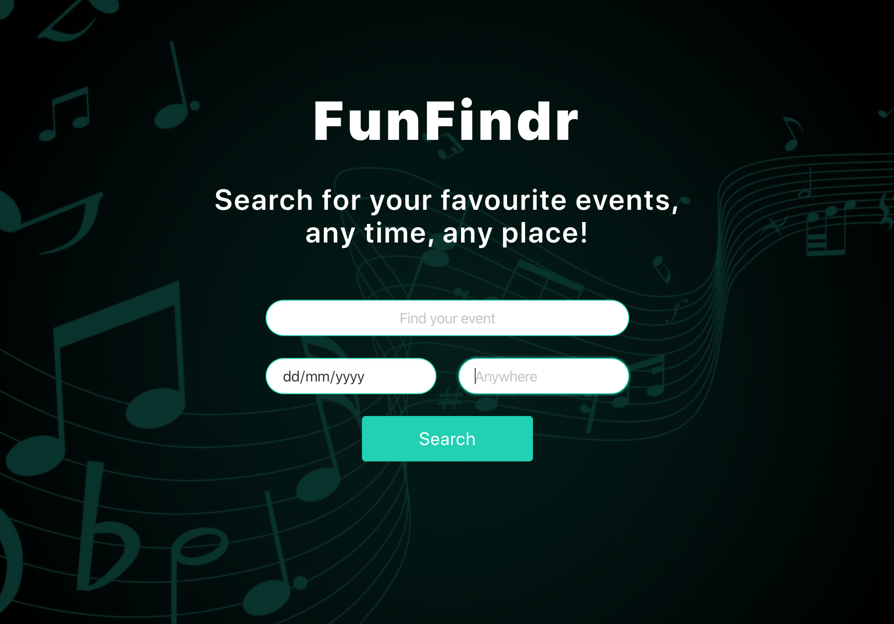
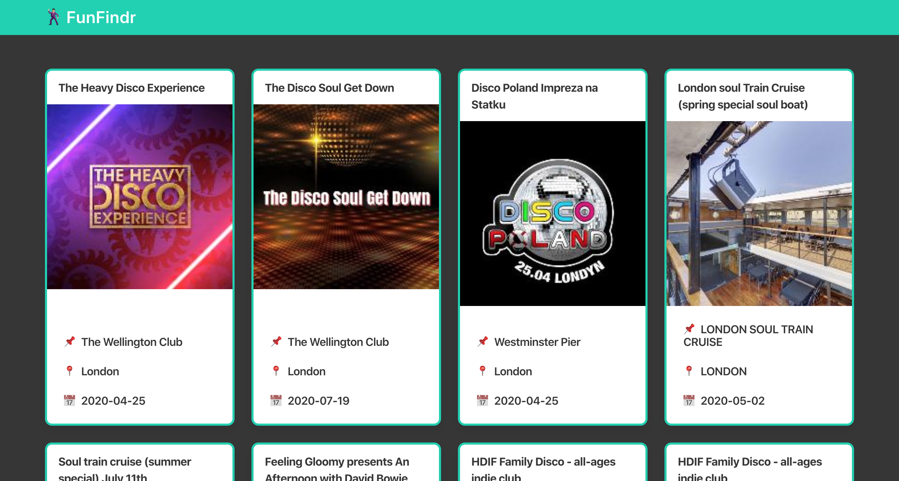
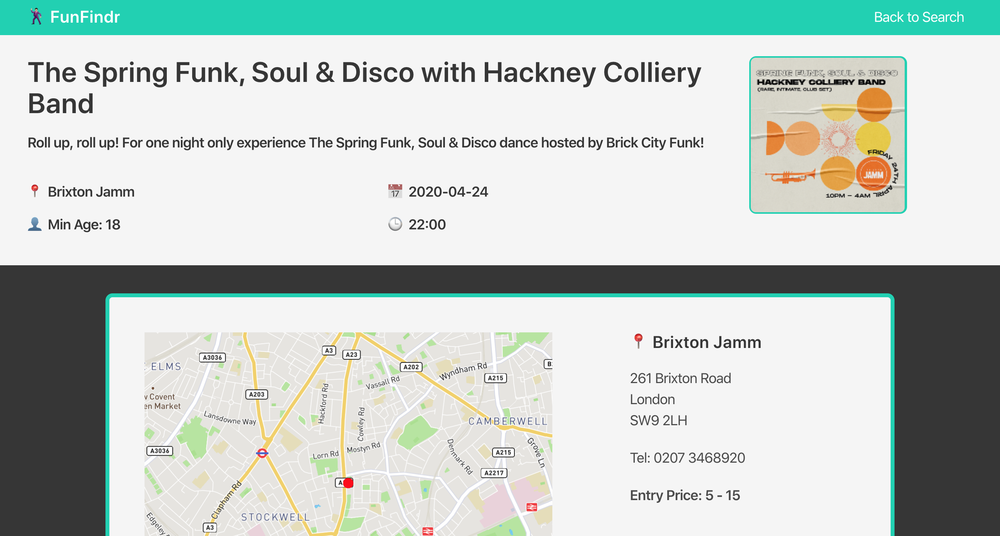

# Software Engineering Immersive: Project 2
This is my second project of the General Assembly Software Engineering Immersive course (Week 6). It was a 3 day Pair-Programming project.

## Installation

* Clone or download the Repository
* From the project root folder, enter the following commands into the terminal:

```
<!-- To install all the packages listed in the package.json: -->
$ npm i

<!-- Run the app in your localhost: -->
$ npm run develop

<!-- Check the console for any issues and if there are any then check the package.json for any missing dependencies -->
```

## Deployment

The game is deployed on Heroku and can be found here: fun-findr.herokuapp.com

## Technologies Used

* Node.js
* React
* Express
* Axios
* SCSS
* Bulma
* Google Fonts
* Git
* GitHub
* Skiddle Events API
* Mapbox API

## Website Architecture

### Overview

The FunFindr app allows users to search events based on keywords, dates and location. The site takes users to a results page, where they can peruse the events open to them given their search preferences. From there, users can click on their chosen event to take them through to an event-specific information page for more details including date, time, location (including a map), price and description of the event.

### Skiddle Events API

The Skiddle Events API accepts requests in the form of a URL, with additional specifications for the data request - such as keyword, latitude, longitude or date - embedded into the URL string. No further data is therefore needed to be attached to the request. More information on the API can be found here: https://github.com/Skiddle/web-api

### Homepage

The objective for the site was very clear and simple - to enable users to find events based off keywords (such as artist names), location and dates. The sole purpose of the homepage therefore is to allow users to input their search preferences and store these parameters in local storage, ready to be embedded into the URL to be sent to the API endpoint from the Events Listings page. Each of the three search parameters are optional, meaning users could choose to leave any or all of them empty. This broadens the search up to a maximum of 100 results - a restriction set by Skiddle on the API.



### Event Listings Page

The Event Listings Page retrieves any keywords, locations and dates that were inputted by the user into the Homepage search function. The format of the URL to be sent to the endpoint requires location to be entered as latitude and longitude coordinates. For this reason, a Mapbox API is used to convert the location (which can be a place name or postcode) into coordinates, using the following function:

```JavaScript
findCoordinates = async (location) => {
  try {
    const locationData = await axios.get(`https://api.mapbox.com/geocoding/v5/mapbox.places/${location}.json?&access_token=${mapboxToken}`)
    const eventCoordinates = [locationData.data.features[0].center[0], locationData.data.features[0].center[1]]
    this.setState({ eventCoordinates })
    this.searchEventsWithLocation(this.state.searchValues.searchWord, this.state.searchValues.searchDate, this.state.eventCoordinates[0], this.state.eventCoordinates[1])
  } catch (err) {
    console.log(err)
  }
}
```

With or without each of the search parameters, the search request is then made to the Skiddle API, and the results render on the page, styled with Bulma to appear as easy-to-read Event Cards for each result. A "No Results" page is also connected to the Events Index component in case there are no matches to the user's search preferences.



The Events Card is re-factored into its own component, with the event details (each key-value pair on the event object) being passed as props. Upon clicking on an Event Card, the Event ID is pushed into the URL for the Event Show Page

### Event Show Page

The Event ID is then taken from the URL and used to make an Axios request for data specifically on that event. The page renders the results, including the details shown on the Event Listing page, together with an event description, opening time, minimum age requirements, price, contact number, address details and a map to show the exact location using Mapbox.



## Reflections

### Wins

* Having a fully-functional, user-friendly search function which can take in optional parameters for keyword, location and dates.
* Location can be postcode or placename due to Mapbox being able to convert either into latitude and longitude coordinates.
* An ergonomic yet sleek homepage design.
* Generally quite clean and tidy code.
* Bulma styling provides professional look with minimal CSS hard-coding and cross-component classname complications.

### Challenges

* Tailoring the logic so that it is able to handle empty search inputs for any of the three parameters.
* Due to the time pressures of this project, it required moments to stop for a second and gain some perspective in order to solve the various challenges that arose along the way.
* Finding an API that was free and accessible proved to be surprisingly difficult.

### Future Features

* Convert dates from YYYY-MM-DD into a more presentable format.
* Fix formatting issue with apostrophes appearing as HTML Character Reference code.
* Enable movement and zoom on Event Show Page map.